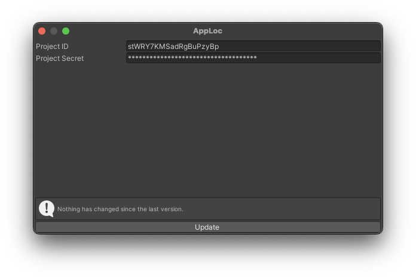

# AppLoc for Unity

The [apploc.dev](https://apploc.dev) plugin for Unity provides seamless localization management for your projects.

## Installation

-   Open Package Manager
-   Add package from git URL:
    <code>https://github.com/apploc-dev/unity.git</code>
    
> [!NOTE]
> This package has been tested on Unity version 2022.3.28 and above. Other versions may work but are not officially supported.

## Usage

### Localization file update

The plugin window can be opened by clicking on **Window > AppLoc**.

Start by pasting your project ID and secret key into the respective fields. These will be automatically saved to <code>ProjectSettings/apploc-prefs.json</code>.

> [!IMPORTANT]
> The project secret only grants read access to the contents of the project — it does not expose or allow access to any project members or their details. This means you can safely add apploc-prefs.json to your version control system without worrying about sensitive information being compromised.

Click the **Update** button to automatically update or create the <code>Assets/Resources/ATLocalizationsObject.asset</code> file.

<div align="center">
    
</div>

### Initialization and localization selection

Initialization is automatic. By default, the manager attempts to find the localization code "EN". If "EN" does not exist, it selects the first localization by index. You can view localization indices in the <code>Assets/Resources/ATLocalizationsObject.asset</code> ScriptableObject.

```csharp
using UnityEngine;
using AppLoc;

public class GameManager : MonoBehaviour {
    private const string LocalizationPlayerPrefsKey = "localization";

    private void Awake() {
        if (PlayerPrefs.HasKey(LocalizationPlayerPrefsKey)) {
            LocalizationManager.SetLocalization(PlayerPrefs.GetString(LocalizationPlayerPrefsKey));
        }
    }

    public void SetEnglishLocalization() => ChangeLocalization("EN");

    public void SetUkrainianLocalization() => ChangeLocalization("UK");

    private static void ChangeLocalization(string localization) {
        if (!LocalizationManager.LocalizationCodes.Contains(localization)) {
            Debug.LogWarning("Can't find localization '" + localization + "'");
        }

        PlayerPrefs.SetString(LocalizationPlayerPrefsKey, localization);
        LocalizationManager.SetLocalization(localization);
    }
}
```

### Localizable objects

Built-in localizable objects:

-   [LocalizableTextMeshPro](./Scripts/Localizables/LocalizableTextMeshPro.cs) for TMPro.TMP_Text
-   [LocalizableLegacyText](./Scripts/Localizables/LocalizableLegacyText.cs) for UnityEngine.UI.Text

To create a custom localizable object, inherit from the <code>AbstractLocalizable</code> class and implement the <code>Localize()</code> method. If necessary, you can override <code>OnEnable()</code> (ensure you call <code>base.OnEnable()</code> after your code).
Also, you can use <code>[LocalizationKey]</code> attribute to validate localization keys.

```csharp
using UnityEngine;
using TMPro;
using AppLoc;

public class LocalizableText : AbstractLocalizable {
    [SerializeField] [LocalizationKey] private string key;

    private TMP_Text _text;

    protected override void OnEnable() {
        _text = GetComponent<TMP_Text>();

        // Call base.OnEnable() after your code
        base.OnEnable();
    }

    protected override void Localize() {
        _text.text = LocalizationManager.GetValue(key);
    }
}
```

## License

This project is licensed under the Apache-2.0 license. See the [LICENSE.md](LICENSE.md) file for details.
